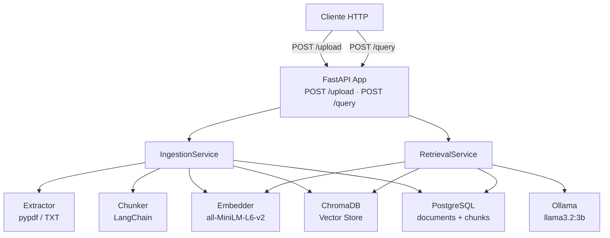
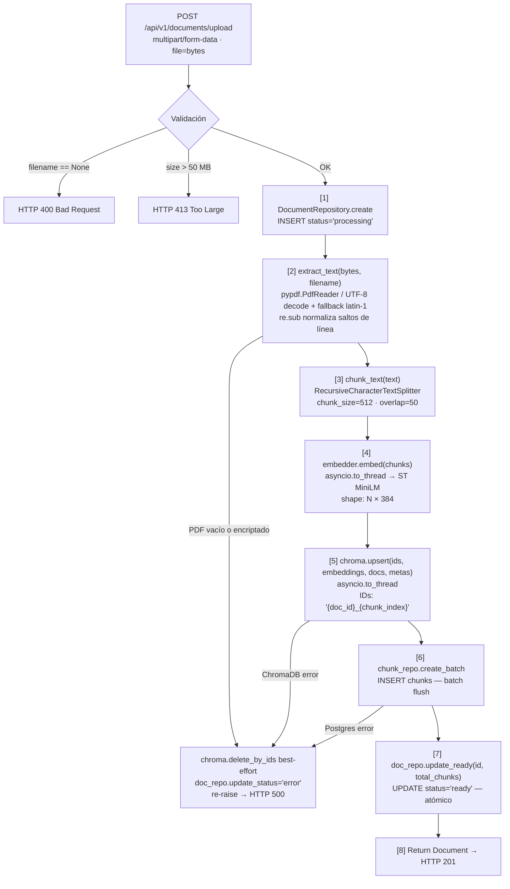
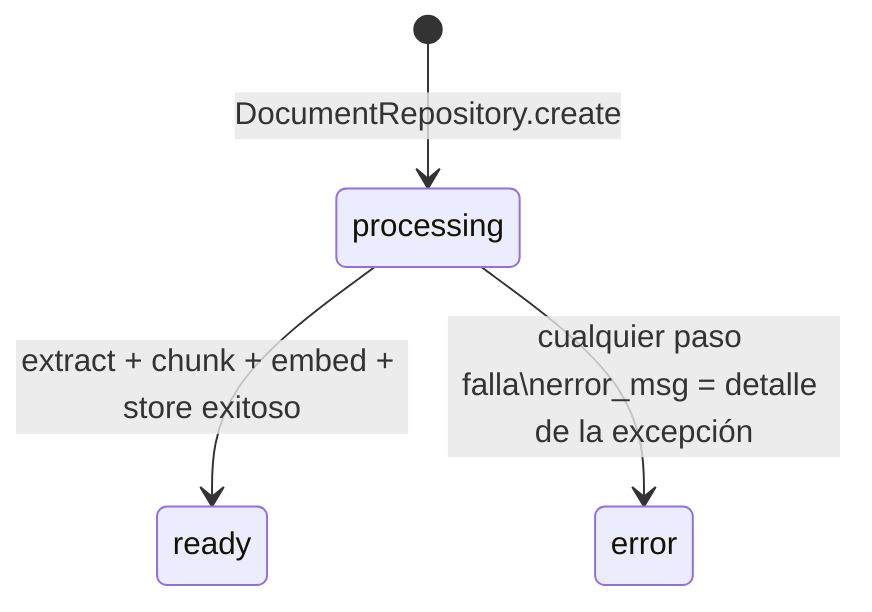
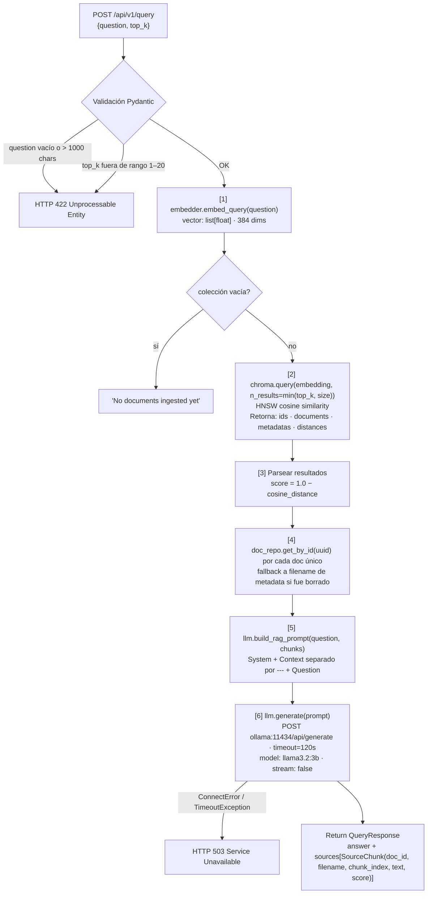
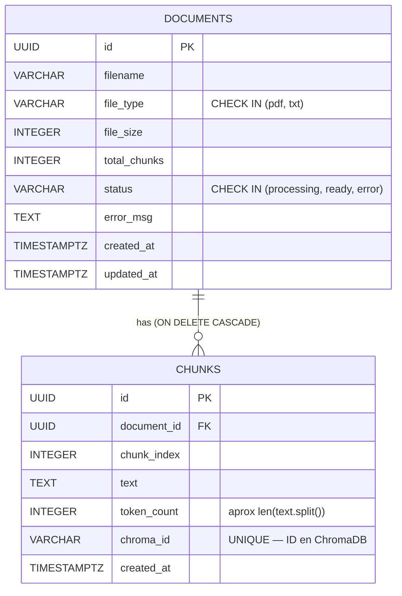
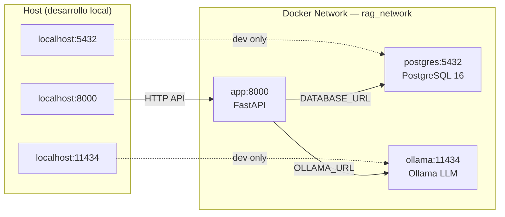
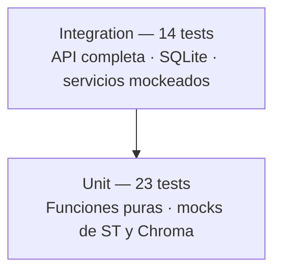

# ARCHITECTURE.md — RAG Simple: Diseño End-to-End

## Índice

1. [Visión General](#1-visión-general)
2. [Diagrama de Componentes](#2-diagrama-de-componentes)
3. [Flujo de Ingesta de Documentos](#3-flujo-de-ingesta-de-documentos)
4. [Flujo de Consulta (Query)](#4-flujo-de-consulta-query)
5. [Capa de Configuración](#5-capa-de-configuración)
6. [Capa de Base de Datos](#6-capa-de-base-de-datos)
7. [Capa de Servicios Core](#7-capa-de-servicios-core)
8. [Capa de Servicios de Negocio](#8-capa-de-servicios-de-negocio)
9. [Capa API (FastAPI)](#9-capa-api-fastapi)
10. [Infraestructura Docker](#10-infraestructura-docker)
11. [Modelo de Datos](#11-modelo-de-datos)
12. [Decisiones de Diseño y Trade-offs](#12-decisiones-de-diseño-y-trade-offs)
13. [Estrategia de Testing](#13-estrategia-de-testing)

---

## 1. Visión General

RAG Simple implementa el patrón **Retrieval-Augmented Generation** en su forma más pura: sin reranking, sin búsqueda híbrida, sin caché. Solo el pipeline fundamental.



---

## 2. Diagrama de Componentes

```
src/rag/
│
├── main.py ─────────────── FastAPI app + lifespan (inicializa singletons)
├── config.py ───────────── pydantic-settings (env vars tipadas)
├── schemas.py ──────────── Pydantic models (request/response DTOs)
│
├── api/
│   ├── deps.py ─────────── Inyección de dependencias (app.state → Depends)
│   └── routes/
│       ├── documents.py ── 4 endpoints: upload, list, get, delete
│       └── query.py ─────── 1 endpoint: POST /query
│
├── core/  ──────────────── Servicios atómicos (sin estado de negocio)
│   ├── extractor.py ─────── PDF/TXT → str
│   ├── chunker.py ───────── str → list[str]
│   ├── embedder.py ──────── list[str] → list[list[float]]
│   └── llm.py ───────────── prompt → str (Ollama HTTP)
│
├── db/  ────────────────── Capa de persistencia
│   ├── postgres.py ──────── Engine async + session factory + get_db()
│   ├── models.py ────────── ORM: Document, Chunk (SQLAlchemy 2.0 Mapped)
│   ├── repositories.py ──── CRUD async (DocumentRepository, ChunkRepository)
│   └── chroma.py ────────── ChromaDB PersistentClient (async wrapping)
│
└── services/  ──────────── Orquestadores del pipeline
    ├── ingestion.py ─────── Pipeline completo de ingesta (8 pasos)
    └── retrieval.py ─────── Pipeline completo de consulta (6 pasos)
```

---

## 3. Flujo de Ingesta de Documentos

### Secuencia completa



### Diagrama de estado del documento



---

## 4. Flujo de Consulta (Query)

### Secuencia completa



### Ejemplo de score de similitud

```
score = 1.0 - cosine_distance

Distancia 0.0 → score 1.0  (idéntico)
Distancia 0.1 → score 0.9  (muy similar)
Distancia 0.4 → score 0.6  (moderado)  ← típico en este sistema
Distancia 0.8 → score 0.2  (poco similar)
Distancia 2.0 → score -1.0 (opuesto)
```

---

## 5. Capa de Configuración

**Archivo:** `src/rag/config.py`

Basado en `pydantic-settings`. Lee variables de entorno (y opcionalmente `.env`).

```python
class Settings(BaseSettings):
    database_url: str       # PostgreSQL async URL
    ollama_url: str         # Ollama API base
    ollama_model: str       # Modelo LLM
    chroma_path: str        # Directorio ChromaDB
    chroma_collection: str  # Nombre de la colección
    embedding_model: str    # Modelo de embeddings
    chunk_size: int         # Tamaño de chunk en caracteres
    chunk_overlap: int      # Overlap entre chunks
    default_top_k: int      # Chunks a recuperar por defecto
    log_level: str          # INFO | DEBUG
    max_upload_size_mb: int # Límite de upload
```

**Patrón singleton con caché:**
```python
@lru_cache
def get_settings() -> Settings:
    return Settings()

settings = get_settings()  # alias conveniente
```

`lru_cache` garantiza una sola instancia. En tests, `get_settings.cache_clear()` permite overrides.

---

## 6. Capa de Base de Datos

### PostgreSQL — SQLAlchemy 2.0 Async

**Archivo:** `src/rag/db/postgres.py`

```python
engine = create_async_engine(settings.database_url, echo=False)
# Sin NullPool — usa AsyncAdaptedQueuePool (default) para connection reuse

AsyncSessionLocal = async_sessionmaker(
    bind=engine,
    class_=AsyncSession,
    expire_on_commit=False,  # evita lazy-load post-commit
)

async def get_db() -> AsyncGenerator[AsyncSession, None]:
    async with AsyncSessionLocal() as session:
        try:
            yield session
            await session.commit()
        except Exception:
            await session.rollback()
            raise
```

**Modelos ORM** (`src/rag/db/models.py`):

Usan la nueva API `Mapped` + `mapped_column` de SQLAlchemy 2.0. Tipo `Uuid()` (no `postgresql.UUID`) para compatibilidad con SQLite en tests.



**Repositorios** (`src/rag/db/repositories.py`):

Patrón Repository — encapsulan todas las queries SQL. Usan `select()`, `update()`, `delete()` (no `session.query()`). `synchronize_session="fetch"` en updates bulk para consistencia de identidad map.

### ChromaDB — Embedded

**Archivo:** `src/rag/db/chroma.py`

ChromaDB corre **embebido** en el proceso de la app (SQLite + HNSW index en disco). Sin servicio separado.

```python
class ChromaClient:
    def __init__(self):
        self._client = chromadb.PersistentClient(
            path=settings.chroma_path,
            settings=ChromaSettings(anonymized_telemetry=False),
        )
        self._collection = self._client.get_or_create_collection(
            name=settings.chroma_collection,
            metadata={"hnsw:space": "cosine"},  # distancia coseno
        )
```

**Async safety:** ChromaDB es síncrono (I/O bloqueante). Todos los métodos públicos usan `asyncio.to_thread()` para no bloquear el event loop de FastAPI.

```python
async def upsert(self, ids, embeddings, documents, metadatas):
    await asyncio.to_thread(self._collection.upsert, ...)

async def query(self, query_embedding, n_results=8):
    return await asyncio.to_thread(self._collection.query, ...)
```

### Alembic — Migraciones Async

**Archivos:** `alembic.ini`, `alembic/env.py`, `alembic/versions/001_initial.py`

Usa el patrón async de Alembic:

```python
# env.py — patrón async
async def run_async_migrations():
    connectable = async_engine_from_config(
        config.get_section(config.config_ini_section),
        poolclass=pool.NullPool,  # NullPool SOLO para migraciones
    )
    async with connectable.connect() as connection:
        await connection.run_sync(do_run_migrations)
```

`NullPool` en migraciones (una conexión, usar y cerrar). El engine de la app usa pooling normal.

---

## 7. Capa de Servicios Core

Servicios atómicos, sin lógica de negocio, sin estado propio.

### Extractor (`src/rag/core/extractor.py`)

```
file_bytes + filename → str

PDF path:
  pypdf.PdfReader(BytesIO(bytes))
    → [page.extract_text() for page in reader.pages]
    → "\n".join(texts)
    → raise ValueError si texto vacío (PDF de imágenes)
    → raise ValueError si PdfReadError (encriptado/corrupto)

TXT path:
  bytes.decode("utf-8")  → fallback → bytes.decode("latin-1")

Post-processing:
  re.sub(r"\n{3,}", "\n\n", text).strip()
```

### Chunker (`src/rag/core/chunker.py`)

```
text → list[str]

RecursiveCharacterTextSplitter(
    chunk_size=512,    # en caracteres (≈ 80-100 tokens)
    chunk_overlap=50,  # solapamiento para no perder contexto en bordes
    separators=["\n\n", "\n", " ", ""]  # divide por párrafo, línea, palabra, char
)

Filtra chunks vacíos/whitespace.
```

**Nota:** `chunk_size=512` es en **caracteres**, no tokens. 512 chars ≈ 100-130 tokens de LLM.

### Embedder (`src/rag/core/embedder.py`)

```
list[str] → list[list[float]]  shape: (N, 384)

Modelo: all-MiniLM-L6-v2
  - 384 dimensiones
  - 22M parámetros
  - Entrenado en similitud semántica (MS MARCO, NLI, etc.)
  - Ideal para retrieval: velocidad + calidad

Async safety:
  embed()       → asyncio.to_thread(embed_sync, texts)
  embed_query() → embed([text])[0]  — wrapper para una query
```

El modelo se carga **una vez** en `__init__` (bloqueante). Ocurre en el lifespan de FastAPI antes de arrancar el servidor.

### LLM Client (`src/rag/core/llm.py`)

```
prompt → str

POST http://ollama:11434/api/generate
Body: {
  "model": "llama3.2:3b",
  "prompt": "<rag_prompt>",
  "stream": false
}
Timeout: 120s (generación puede tardar 30-60s en CPU)

Error handling:
  ConnectError/TimeoutException → OllamaError
  status != 200                 → OllamaError
  response sin "response" key   → OllamaError

RAG Prompt format:
  "You are a helpful assistant. Answer the question based ONLY on the
   provided context. Answer in the same language as the question.
   If the context does not contain enough information, say so briefly
   and summarize what the context does cover.

   Context:
   ---
   {chunk_1}
   ---
   {chunk_2}
   ---

   Question: {question}

   Answer:"
```

---

## 8. Capa de Servicios de Negocio

Orquestadores del pipeline. Reciben sus dependencias por constructor (inyección).

### IngestionService (`src/rag/services/ingestion.py`)

```python
class IngestionService:
    def __init__(self, embedder: Embedder, chroma: ChromaClient):
        ...
    
    async def ingest(self, file_bytes: bytes, filename: str, db: AsyncSession) -> Document:
        # 8 pasos — ver sección 3
```

**Garantías de consistencia:**
- Si ChromaDB falla → no se crea registro en Postgres
- Si Postgres falla después de ChromaDB → limpia vectores en Chroma (best-effort)
- El documento queda en `status='error'` si cualquier paso falla

### RetrievalService (`src/rag/services/retrieval.py`)

```python
class RetrievalService:
    def __init__(self, embedder: Embedder, chroma: ChromaClient, llm: OllamaClient):
        ...
    
    async def query(self, question: str, top_k: int, db: AsyncSession) -> QueryResponse:
        # 6 pasos — ver sección 4
```

**Guard para colección vacía:** `min(top_k, await chroma.count())` — ChromaDB lanza excepción si `n_results > len(collection)`.

---

## 9. Capa API (FastAPI)

### Inicialización — Lifespan (`src/rag/main.py`)

```python
@asynccontextmanager
async def lifespan(app: FastAPI):
    # Inicialización (antes de arrancar)
    chroma = ChromaClient()          # abre SQLite de ChromaDB
    embedder = Embedder(...)         # carga modelo ST (bloqueante ~2s)
    llm = OllamaClient(...)          # cliente HTTP, no hace I/O aquí
    
    app.state.chroma = chroma
    app.state.embedder = embedder
    app.state.llm = llm
    app.state.ingestion_service = IngestionService(embedder, chroma)
    app.state.retrieval_service = RetrievalService(embedder, chroma, llm)
    
    yield  # ← app sirve requests aquí
    
    # Teardown (al parar el servidor)
    logger.info("shutting down")
```

### Inyección de Dependencias (`src/rag/api/deps.py`)

```python
# Singletons — extraídos de app.state
def get_chroma(request: Request) -> ChromaClient:
    return request.app.state.chroma

def get_ingestion_service(request: Request) -> IngestionService:
    return request.app.state.ingestion_service

# DB session — nueva por request
def get_db() -> AsyncGenerator[AsyncSession, None]:
    # commit on success, rollback on exception
```

Los servicios son **singletons** (un objeto por lifetime de la app).
La sesión de DB es **por request** (nueva conexión por operación).

### Manejo de Errores por Capa

```
UnsupportedFileTypeError  →  HTTP 400 Bad Request
ValueError (PDF vacío)    →  HTTP 422 Unprocessable Entity
archivo sin filename       →  HTTP 400 Bad Request
archivo > 50MB            →  HTTP 413 Request Entity Too Large
documento no encontrado   →  HTTP 404 Not Found
OllamaError               →  HTTP 503 Service Unavailable
cualquier otro error       →  HTTP 500 Internal Server Error
```

---

## 10. Infraestructura Docker

### Servicios (`docker-compose.yml`)

```yaml
services:
  postgres:                    # PostgreSQL 16 Alpine
    healthcheck: pg_isready    # Verifica disponibilidad antes de arrancar app
    volumes: postgres_data     # Persistencia en volumen nombrado

  ollama:                      # Servidor LLM local
    healthcheck: ollama list   # Verifica que el proceso esté listo
    volumes: ollama_data       # Modelos descargados persisten

  app:                         # FastAPI
    build: docker/Dockerfile   # Python 3.11-slim + uv
    depends_on:
      postgres: {condition: service_healthy}
      ollama:   {condition: service_healthy}
    volumes: chroma_data       # ChromaDB persiste entre reinicios
```

### Dockerfile (`docker/Dockerfile`)

```dockerfile
FROM python:3.11-slim
WORKDIR /app

# Seguridad: usuario no-root
RUN adduser --disabled-password --gecos "" appuser

# Instalador rápido de paquetes
RUN pip install uv==0.5.29

# Código fuente primero (necesario para que pip install encuentre el paquete)
COPY pyproject.toml .
COPY alembic.ini .
COPY alembic/ alembic/
COPY src/ src/

# Instala el paquete y todas sus dependencias (~2GB con torch/ST)
RUN uv pip install --system --no-cache .

# Permisos correctos para ChromaDB
RUN mkdir -p /app/chroma_data && chown -R appuser:appuser /app

USER appuser
CMD ["uvicorn", "rag.main:app", "--host", "0.0.0.0", "--port", "8000"]
```

**Orden crítico:** `COPY src/` → `pip install .` (el paquete debe existir al instalar).

### Redes y Comunicación



---

## 11. Modelo de Datos

### PostgreSQL Schema

```sql
-- Documentos ingresados
CREATE TABLE documents (
    id           UUID PRIMARY KEY DEFAULT gen_random_uuid(),
    filename     VARCHAR(255) NOT NULL,
    file_type    VARCHAR(10)  NOT NULL,
    file_size    INTEGER,
    total_chunks INTEGER      DEFAULT 0,
    status       VARCHAR(20)  DEFAULT 'processing',
    error_msg    TEXT,
    created_at   TIMESTAMPTZ  DEFAULT NOW(),
    updated_at   TIMESTAMPTZ  DEFAULT NOW(),
    
    CONSTRAINT ck_document_file_type CHECK (file_type IN ('pdf', 'txt')),
    CONSTRAINT ck_document_status   CHECK (status IN ('processing', 'ready', 'error'))
);

-- Fragmentos de texto con su ID en ChromaDB
CREATE TABLE chunks (
    id           UUID PRIMARY KEY DEFAULT gen_random_uuid(),
    document_id  UUID      NOT NULL REFERENCES documents(id) ON DELETE CASCADE,
    chunk_index  INTEGER   NOT NULL,
    text         TEXT      NOT NULL,
    token_count  INTEGER,                        -- aproximación de palabras
    chroma_id    VARCHAR(100) NOT NULL UNIQUE,   -- "{document_id}_{chunk_index}"
    created_at   TIMESTAMPTZ DEFAULT NOW()
);

CREATE INDEX idx_chunks_document_id ON chunks(document_id);
```

### ChromaDB Schema (lógico)

```
Collection: "rag_documents"
  metadata: {"hnsw:space": "cosine"}

Document (vector entry):
  id:        "{document_uuid}_{chunk_index}"
  embedding: [float] × 384                    -- all-MiniLM-L6-v2
  document:  "texto del chunk..."
  metadata:  {
    "document_id":  "uuid-string",
    "filename":     "doc.pdf",
    "chunk_index":  0
  }
```

**Relación Postgres ↔ ChromaDB:** el campo `chunks.chroma_id` es la llave foránea lógica entre ambas bases de datos.

---

## 12. Decisiones de Diseño y Trade-offs

### ChromaDB Embedded vs Weaviate/Qdrant

| | ChromaDB Embedded | Weaviate/Qdrant |
|--|---|---|
| Setup | Cero — corre in-process | Servicio Docker adicional |
| Escalabilidad | Un solo proceso | Horizontal, multi-tenant |
| Latencia | ~1ms (in-process) | ~5-20ms (network) |
| Para este proyecto | ✅ Ideal | Overkill |

### Sentence-Transformers vs OpenAI Embeddings

| | all-MiniLM-L6-v2 | OpenAI ada-002 |
|--|---|---|
| Costo | Gratuito | $0.0001/1K tokens |
| Privacidad | Local, sin API | Datos salen a OpenAI |
| Calidad | Buena (MTEB benchmark) | Superior |
| Velocidad | ~50ms/batch CPU | ~100-200ms/API call |
| Para portfolio | ✅ Demuestra setup local | Oculta complejidad |

### NullPool en Migraciones vs Pool en App

Alembic usa `NullPool` porque crea una sola conexión y la cierra. La app usa `AsyncAdaptedQueuePool` (default) para reutilizar conexiones entre requests — crítico para rendimiento bajo carga.

### Orden de Delete (Postgres → Chroma)

Se elimina Postgres primero para aprovechar `ON DELETE CASCADE` en chunks. Chroma es best-effort: si falla, quedan vectores huérfanos pero el registro metadata está limpio. El orden inverso dejaría metadata sin vectores (peor inconsistencia).

### SQLAlchemy `Uuid()` vs `postgresql.UUID`

`postgresql.UUID` no compila contra SQLite. Los tests usan SQLite in-memory para aislamiento. `sqlalchemy.Uuid()` es el tipo cross-backend de SQLAlchemy 2.0 — soporta PostgreSQL nativo y SQLite como string.

---

## 13. Estrategia de Testing

### Pirámide de Tests



### Aislamiento

| Dependencia | En tests |
|-------------|----------|
| PostgreSQL | SQLite in-memory (aiosqlite) |
| ChromaDB | `AsyncMock` — simula respuestas |
| SentenceTransformer | `patch("rag.core.embedder.SentenceTransformer")` |
| Ollama | `AsyncMock(return_value="generated text")` |

### Fixtures clave (`tests/conftest.py`)

```python
db_engine    # SQLite async engine con tablas creadas
db_session   # Sesión limpia por test
mock_chroma  # AsyncMock con respuestas realistas (ids, distances, metadatas)
mock_embedder # AsyncMock con side_effect — retorna N vectores para N textos
mock_llm     # AsyncMock — generate, health_check, build_rag_prompt
client       # AsyncClient(ASGITransport) con todos los overrides + app.state manual
```

**app.state en tests:** el lifespan no corre en tests (no hay servidor real). El fixture `client` inyecta manualmente todos los valores en `app.state` y limpia después de cada test con `delattr`.

### Cobertura de Casos Críticos

- ✅ Upload PDF y TXT → chunks en DB
- ✅ Upload tipo no soportado → 400
- ✅ Upload sin filename → 400
- ✅ Archivo > 50MB → 413
- ✅ Query con respuesta → answer + sources con score
- ✅ Query con Ollama caído → 503
- ✅ Query campo vacío → 422 (validación Pydantic)
- ✅ Delete → 204, desaparece de list
- ✅ Get documento inexistente → 404
- ✅ Embedding shape correcta (N chunks → N vectores 384-dim)
- ✅ Chunking con overlap, sin strings vacíos
- ✅ Extracción PDF/TXT/latin-1/whitespace
