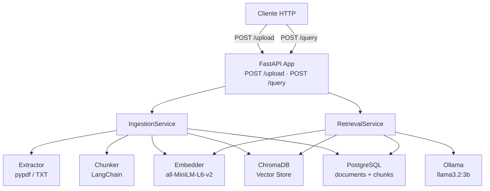
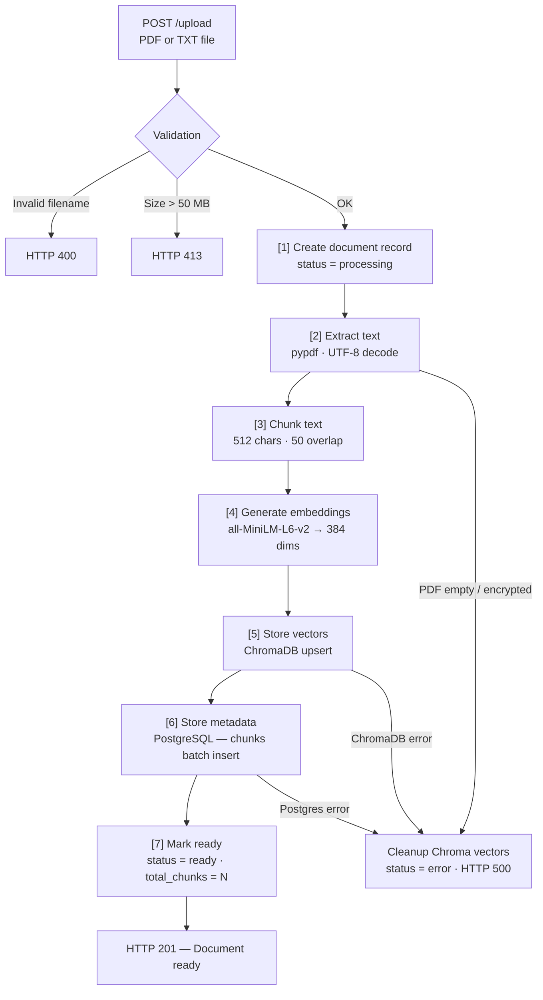
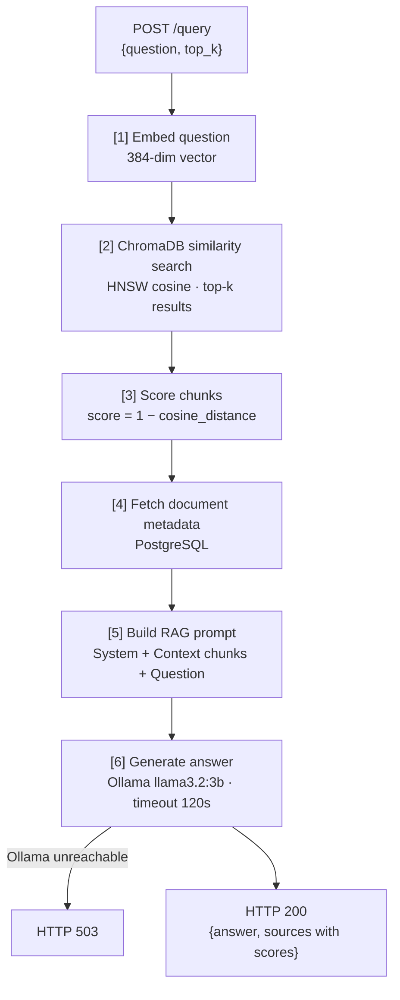

# RAG Simple — Contextualized Document Q&A

> A production-grade Retrieval-Augmented Generation API that lets you upload PDF/TXT documents and ask natural language questions answered with cited source chunks.

## Architecture

### System overview



### Ingestion pipeline



### Query flow



## Tech Stack

| Component        | Technology                   | Why                                                         |
|------------------|------------------------------|-------------------------------------------------------------|
| API framework    | FastAPI                      | Async-native, automatic OpenAPI docs, dependency injection  |
| LLM inference    | Ollama (llama3.2:3b)         | Local inference, no API costs, easy Docker deployment       |
| Embeddings       | sentence-transformers        | Fast, high-quality 384-dim vectors without GPU requirement  |
| Vector store     | ChromaDB                     | Simple embedded vector DB with cosine similarity search     |
| Relational DB    | PostgreSQL + SQLAlchemy 2.x  | Durable metadata store with async ORM support               |
| PDF parsing      | pypdf                        | Pure-Python PDF extraction, no system dependencies          |
| Text splitting   | LangChain text splitters     | Battle-tested recursive character splitter                  |
| Logging          | structlog                    | Structured JSON logs in production, colored output in dev   |

## Prerequisites

- Docker + Docker Compose
- 4 GB RAM minimum (for Ollama model)
- Python 3.11+ (for local development)

## Quick Start

### 1. Clone and configure

```bash
git clone https://github.com/your-username/project_rag_simple.git
cd project_rag_simple
cp .env.example .env
```

### 2. Start services

```bash
docker compose up -d
```

### 3. Pull the LLM model

```bash
docker compose exec ollama ollama pull llama3.2:3b
```

### 4. Run database migrations

```bash
docker compose exec app alembic upgrade head
```

### 5. Upload a document

```bash
curl -X POST http://localhost:8000/api/v1/documents/upload \
  -F "file=@your_document.pdf"
```

### 6. Ask a question

```bash
curl -X POST http://localhost:8000/api/v1/query \
  -H "Content-Type: application/json" \
  -d '{"question": "What is this document about?", "top_k": 5}'
```

## API Reference

| Method | Path                                | Description                                    |
|--------|-------------------------------------|------------------------------------------------|
| POST   | `/api/v1/documents/upload`          | Upload a PDF or TXT file for ingestion         |
| GET    | `/api/v1/documents/`                | List all ingested documents                    |
| GET    | `/api/v1/documents/{document_id}`   | Get document details with chunk metadata       |
| DELETE | `/api/v1/documents/{document_id}`   | Delete document and all its vectors            |
| POST   | `/api/v1/query`                     | Ask a question; returns answer + source chunks |
| GET    | `/health`                           | Health check for Postgres, ChromaDB, Ollama    |

Interactive docs are available at `http://localhost:8000/docs` when the server is running.

## Development Setup

Local development without Docker (for faster iteration):

```bash
python -m venv .venv
source .venv/bin/activate
pip install -e ".[dev]"

# Copy and edit environment variables
cp .env.example .env
# Set DATABASE_URL, OLLAMA_URL, CHROMA_HOST, etc. in .env

# Run tests
pytest tests/
```

Set `LOG_LEVEL=DEBUG` in `.env` to get colored console output instead of JSON logs.

## Project Structure

```
src/rag/
├── main.py               # FastAPI app factory, lifespan, structlog configuration
├── config.py             # Pydantic Settings (reads from .env)
├── schemas.py            # Pydantic request/response models
├── api/
│   ├── deps.py           # FastAPI dependency providers (DB session, services)
│   └── routes/
│       ├── documents.py  # Upload, list, get, delete document endpoints
│       └── query.py      # Natural language query endpoint
├── core/
│   ├── extractor.py      # PDF and TXT text extraction
│   ├── chunker.py        # Overlapping window text splitting
│   ├── embedder.py       # sentence-transformers async wrapper
│   └── llm.py            # Ollama HTTP client and prompt builder
├── db/
│   ├── models.py         # SQLAlchemy ORM models (Document, Chunk)
│   ├── postgres.py       # Async engine and session factory
│   ├── chroma.py         # ChromaDB async client wrapper
│   └── repositories.py   # Repository pattern for DB access
└── services/
    ├── ingestion.py      # Full ingestion pipeline orchestrator
    └── retrieval.py      # Full query pipeline orchestrator
```

## What This Demonstrates

- **RAG pipeline implementation** — end-to-end ingestion and retrieval with real vector similarity search
- **Vector database integration** — ChromaDB upsert, cosine query, and bulk delete with rollback-safe cleanup
- **Async Python (FastAPI + SQLAlchemy)** — fully async request handling with `asyncio.to_thread` for CPU-bound embedding
- **Repository pattern** — clean separation between business logic and data access across two databases
- **Docker orchestration** — multi-service Compose setup with health checks and dependency ordering
- **Structured logging** — `structlog` with JSON output in production and human-readable output in debug mode
- **Test isolation with mocks** — unit and integration tests with patched DB sessions and mocked external services
